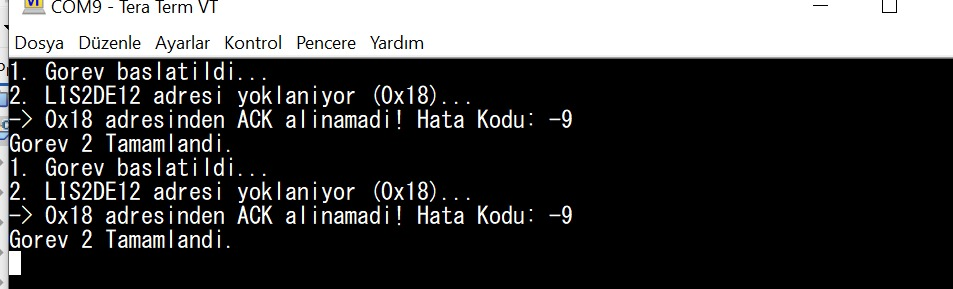

03.08.2026 – I2C Haberleşme Protokolü, Bus Tarama ve Sensör Register Okuması

Bu çalışma gününde mikrodenetleyicilerde yaygın olarak kullanılan I2C haberleşme protokolünün teorik yapısı ve uygulama esasları incelendi. UART ve SPI protokollerinden farklı olarak yalnızca iki haberleşme hattı kullanan I2C yapısının çalışma mantığı öğrenildi. Ayrıca geliştirme kartı üzerindebulunan I2C hattına bağlı çevre birimlerinin yazılımsal olarak tespit edilmesi ve sensör register bilgilerinin okunması hedeflendi.

İlk olarak I2C protokolünde kullanılan SDA ve SCL hatlarının görevleri, master-slave mimarisi, 7 bit adresleme yöntemi, START ve STOP koşulları ile ACK/NACK onay mekanizmaları ayrıntılı olarak incelendi. Open-drain yapısı nedeniyle pull-up direnç kullanımının önemi ve clock stretching mekanizmasının haberleşmeye etkisi değerlendirildi. Daha sonra I2C2 hattına bağlı cihazları belirlemek amacıyla 0x08 ile 0x77 adres aralığını tarayan bir I2C Scanner algoritması geliştirildi. Çalışmalar sırasında oluşan bus lock-up ve watchdog reset problemleri analiz edilerek haberleşme fonksiyonlarında yapılan düzenlemeler sayesinde sorun giderildi. Son aşamada LIS2DE12 ivmeölçer sensörünün WHO_AM_I register değeri okunmaya çalışıldıve elde edilen sonuçlar UART üzerinden terminal ekranına aktarılarak sistem davranışı değerlendirildi.

Gerçekleştirilen çalışmalar sonucunda I2C haberleşme protokolünün çalışma prensipleri uygulamalı olaraköğrenildi. Geliştirilen bus tarama algoritması sayesinde haberleşme hattındaki cihazlar kontrol edildi, oluşan haberleşme hatalarının nedenleri analiz edildi ve gerekli yazılımsal iyileştirmeler gerçekleştirildi. Sensör register okuma işlemleri ile I2C altyapısının doğrulanması sağlanırken, UART üzerinden alınan hata kodları kullanılarak sistemin hata ayıklama süreci başarıyla tamamlandı. Böylece I2C tabanlı çevre birimlerinin yönetimi ve gömülü sistemlerde haberleşme altyapısının oluşturulması 
konusunda uygulamalı deneyim kazanılmış oldu.

---- GÖREV 3 TEOİK SORULAR ------- 

1. I2C nedir?
İki hat (SDA ve SCL) üzerinden çoklu cihaz desteği sunan, senkron ve seri bir haberleşme protokolüdür.

2. UART ve SPI’dan farkı nedir?
UART asenkrondur (clock yoktur). SPI 4+ hat kullanır ve cihaz seçimi (CS) gerektirir. I2C ise sadece 2 hat kullanır ve cihazları adresleme ile seçer.

3. SDA ve SCL ne işe yarar?
SDA (Serial Data) veri akışını, SCL (Serial Clock) ise haberleşmenin senkronizasyonunu sağlayan saat sinyalini taşır.

4. Master ve Slave nedir?
Master haberleşmeyi başlatan ve clock (SCL) üreten ana cihazdır. Slave ise kendi adresi çağrıldığında yanıt veren hedef cihazdır.

5. 7-bit ve 10-bit adres nedir?
I2C hattındaki cihazları ayırt eden kimliklerdir. 7-bit yaygın olandır (max 128 cihaz), 10-bit ise daha fazla cihaz (max 1024) bağlamak için kullanılır.

6. ACK / NACK nedir?
ACK, verinin hatasız alındığını bildiren onaydır (SDA Low). NACK, iletişimin bittiğini veya cihazın hazır olmadığını belirtir (SDA High).

7. START ve STOP koşulları nasıl oluşur?
SCL High konumundayken SDA'nın High'dan Low'a çekilmesi START; SCL High iken SDA'nın Low'dan High'a çekilmesi STOP koşuludur.

8. Clock Stretching nedir?
Slave cihazın gelen veriyi işlemek için zamana ihtiyaç duyduğunda SCL hattını Low'da tutarak Master'ı bekletmesi durumudur.

9. Pull-up direnç neden kullanılır?
I2C hatları open-drain (açık drenaj) olduğu için cihazlar hattı sadece Low'a çekebilir. Hat boşta iken sinyalin High (1) seviyesinde tutulabilmesi için pull-up dirençleri zorunludur.

Görev 1 Görüntüsü:

Görev 2 Görüntüsü:

