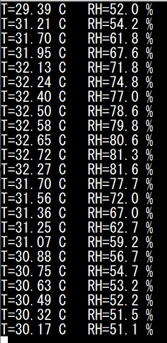
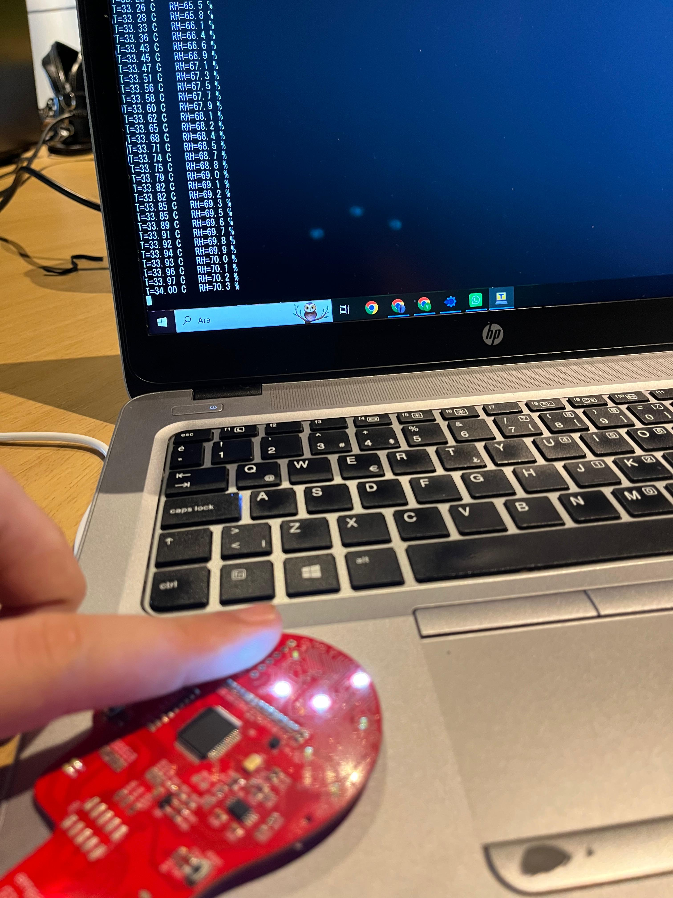

Tarih: 04.08.2026

Konu Başlığı: ABOV Mikrodenetleyici ile SHT40 Sıcaklık ve Nem Sensörünün I2C Protokolü Üzerinden Entegrasyonu ve Eşik Tabanlı LED Kontrolü

Bugünkü staj çalışmamda, ABOV mikrodenetleyici tabanlı gömülü sistem kartı üzerinde I2C protokolü kullanarak SHT40 sıcaklık ve nem sensörünün donanımsal 
ve yazılımsal entegrasyonunu gerçekleştirdim. İlk aşamada, Sensirion kütüphanesinin alt seviye gereksinimlerini karşılamak amacıyla HAL katmanını 
yapılandırdım. Zamanlama uyumsuzluklarından kaynaklanan I2C iletişim hatalarını, uygun gecikme döngüleri ve ham veri okuma yöntemleriyle giderdim.

Yazılım mimarisini daha profesyonel ve modüler hale getirmek için LED kontrol kodlarını "led.c" ve "led.h" modüllerine ayırdım. Donanımsal olarak 
Active-Low mantığıyla çalışan LED'leri, ortam sıcaklığı 30 derece eşik değerini aşarsa yakacak, altına düşerse söndürecek koşullu kontrol 
mekanizmasını ekledim. Buna ek olarak, ardışık iletişim hatalarında devreye giren bir "sensor offline" güvenlik ve hata yönetim mekanizması kurdum. 
Geliştirdiğim bu gömülü yazılımı derleyip karta yükledikten sonra, UART üzerinden Tera Term ekranına yansıyan anlık sıcaklık ve nem verilerini başarıyla 
gözlemleyip test ettim.

Teorik Sorular 
1. SHT40’ın tipik 7-bit I2C adresi nedir? Write frame’de bus’a giden ilk byte kabaca ne olur?

SHT40’ın 7-bit I2C adresi 0x44'tür. Write frame'de bus'a giden ilk byte, adresin 1 bit sola kaydırılıp Write (0) bitinin eklenmesiyle 0x88 olur.

2. SHT40’ta klasik WHO_AM_I register yerine ne kullanılır? Dünkü LIS/MPU yaklaşımından farkı nedir?

WHO_AM_I register yerine komut tabanlı seri numarası okuma fonksiyonu kullanılır. LIS/MPU gibi sensörlerde sabit register okunurken, Sensirion sensörlerinde komut gönderilerek dahili UID çekilir.

3. Bir ölçüm cevabında gelen 6 byte’ın sırası nedir? CRC neden vardır?

 Sıcaklık MSB, Sıcaklık LSB, Sıcaklık CRC, Nem MSB, Nem LSB, Nem CRC şeklindedir. CRC, veri bütünlüğünü doğrulamak ve iletişim hatalarını tespit etmek için vardır.

4. Ölçüm komutundan hemen sonra beklemeden okursan ne olur? Sleep / delay’in rolü nedir?

Sensör ölçümü henüz bitirmediği için I2C NACK alınır veya eski/hatalı veri okunur. Delay, sensörün dahili dönüşüm yapabilmesi için gereken süreyi sağlar.

5. Sensirion kütüphanesinde neden tüm projeyi baştan yazmak yerine sadece HAL katmanını değiştiriyoruz?

Kodun taşınabilirliği ve modülerliği için. Sensörün algoritmaları değiştirilmeden, sadece kullanılan mikrodenetleyiciye (ABOV) ait donanım katmanı uyarlanır.

6. HAL_I2C_IsDeviceReady() başarılı ama sht4x_measure sürekli hata veriyorsa ilk bakacağın 3 şey nedir?

Yetersiz bekleme (delay) süresi
Yanlış ölçüm komut byte'ı
I2C clock hızı veya zamanlama uyumsuzluğu

7. Ham tick ile °C / %RH arasındaki ilişkiyi kim tanımlar (datasheet mi, senin uydurman mı)?

Datasheet (Üretici firma Sensirion tarafından tanımlanan formüller).

8. Pull-up olmasa dün scanner ve bugün SHT40 ölçümü neden ikisi birden bozulur?

I2C hatları open-drain yapıda olduğundan, pull-up dirençleri olmadan hatlar lojik seviyede yukarı çekilemez; bus boşta kalır ve haberleşme tamamen çöker.

Görev Görüntüsü:

Bonus Görüntüsü:

