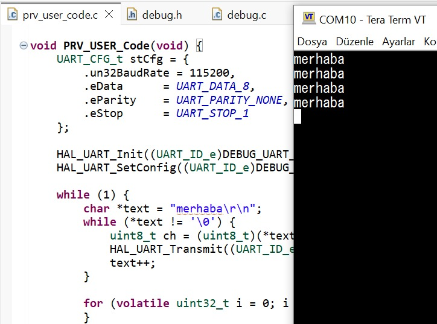

27.07.2026 – UART Teorisi ve Modüler Debug Library Uygulaması

Stajın ikinci haftasının ilk gününde mikrodenetleyicilerde kullanılan seri haberleşme sistemleri üzerine teorik ve uygulamalı çalışmalar gerçekleştirildi.
Özellikle UART haberleşme protokolünün çalışma prensibi incelenerek gömülü sistemlerde veri aktarımının nasıl sağlandığı öğrenildi. 
Bunun yanında geliştirme kartının donanım şeması analiz edilerek hata ayıklama amacıyla kullanılacak UART hattı belirlendi.

İlk olarak seri ve paralel haberleşme yöntemleri karşılaştırıldı ve UART protokolünün asenkron yapısı detaylı olarak incelendi. Haberleşmede kullanılan start biti, veri bitleri, 
parite biti ve stop bitinin görevleri öğrenildi. Ayrıca 8N1 haberleşme formatı ile baud rate kavramının sistem performansına etkisi değerlendirildi. 
Daha sonra geliştirme kartının şeması incelenerek USB-C üzerinden bilgisayara veri aktaran debug UART birimi tespit edildi ve gerekli çevre birimi ayarları 
yapıldı. Ardından debug.c ve debug.h dosyalarından oluşan modüler bir kütüphane geliştirilerek UART üzerinden metin gönderimini sağlayan fonksiyonlar 
yazıldı. Hazırlanan fonksiyonlar ana programa eklenerek sistem açılışında çalışacak şekilde yapılandırıldı.

Uygulama sonunda geliştirilen Debug Library kullanılarak farklı test mesajları UART üzerinden bilgisayara gönderildi. 
Tera Term programında 115200 baud ve 8N1 ayarlarıyla alınan veriler doğrulanarak haberleşmenin sorunsuz çalıştığı gözlemlendi. 
Böylece UART haberleşmesi, donanım yapılandırması ve modüler yazılım geliştirme süreci uygulamalı olarak öğrenilmiş oldu.

UART merhaba Görüntüsü:

