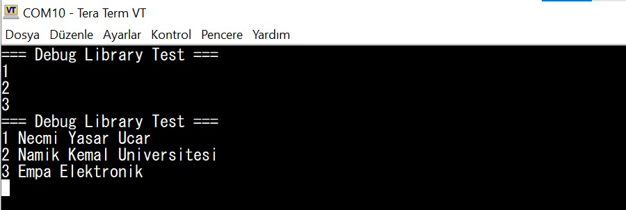
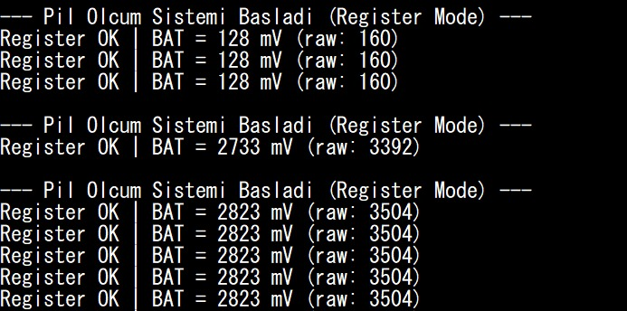

Tarih: 28.07.2026, Salı
Konu: ADC Teorisi, Donanım Şeması Analizi ve Pil Gerilimi Okuma Uygulaması

1. ADC Teorisi ve Çözünürlük Kavramları
Mikrodenetleyicilerin gerçek dünyadaki sürekli (analog) sinyalleri işleyebilmesi için gereken Analog-Dijital Dönüştürücü (ADC)
 modülünün temel çalışma prensipleri incelenmiştir. İşlemcinin yalnızca 1 ve 0'lardan oluşan lojik verileri anlamlandırması sebebiyle voltaj gibi değişken
 sinyallerin ayrık dijital değerlere dönüştürülme süreci detaylıca çalışılmıştır:

* Çözünürlük ve Seviyeler: ADC'nin dijitalleştirme hassasiyetini belirleyen bit sayısı kavramı ele alınmıştır. 12-bit çözünürlüğe sahip bir sistemde (2^12) 
toplam 4096 farklı dijital seviye olduğu ve ham (raw) okuma değerlerinin 0 ile 4095 arasında değiştiği kavranmıştır.
* Referans Gerilimi (Vref) ve Adım Boyutu: ADC modülünün ölçebileceği maksimum voltajı belirleyen Vref değeri (örneğin 3.3V) ve bu referansın 
dijital seviyelere bölünmesiyle elde edilen adım boyutu (LSB gerilimi) hesaplanma mantığı öğrenilmiştir.

2. Donanım Şeması İncelemesi ve Batarya Ölçüm Hattı (VBAT) Analizi
Geliştirme kartının donanım şeması ve ABOV A34G43x mikrodenetleyici datasheet dokümanı üzerinden pil gerilimini okuyan donanımsal hat (VBAT) 
tespit edilmiştir. Pil geriliminin (tam şarjda ~4.2V), mikrodenetleyicinin doğrudan kabul edebileceği referans voltajını (3.3V) aşması nedeniyle 
aradaki donanımsal koruma mekanizmaları incelenmiştir:

* Kanal Tespiti: Kart şemasından gelen fiziksel pinin, işlemci içindeki ADC multiplexer yapısında hangi ADC kanalına denk geldiği datasheet tablosu 
üzerinden doğrulanmış ve yanlış kanal seçiminin okuma hatalarına (gürültü vb.) yol açacağı saptanmıştır.

3. Pil Geriliminin Hesaplanması ve Tera Term Üzerinden Loglanması
Teorik hesaplamalar ve donanım konfigürasyonları tamamlandıktan sonra, tespit edilen ADC kanalı üzerinden yazılımsal olarak 
"Tek Çevrim" (Single Conversion) modunda pil gerilimi okuma işlemi gerçekleştirilmiştir:

* Okunan ham (raw) ADC verisi; adım boyutu ve gerilim bölücü katsayısı ile yazılım içerisinde çarpılarak milivolt (mV) ve volt (V)
 cinsinden anlamlı fiziksel verilere dönüştürülmüştür.
* Elde edilen pil gerilimi değeri, önceki günlerde oluşturulan UART köprüsü (printf fonksiyonu) aracılığıyla her 5 saniyede bir güncellenecek 
şekilde sonsuz döngü (while) içerisine alınmıştır. Bilgisayar tarafında Tera Term programı üzerinden seri port bağlantısı kurularak pil gerilimi 
çıktıları canlı olarak doğrulanmıştır.

## Teorik sorular (cevapları rapora yaz)

**1.** ADC açılımı nedir? Analog sinyali neden doğrudan mikrodenetleyici işleyemez?

ADC'nin açılımı Analog to Digital Converter (Analog-Dijital Dönüştürücü)'dır. Mikrodenetleyiciler sadece dijital mantıkla (0'lar ve 1'ler) çalışır. Doğadaki pil gerilimi, ısı, ışık gibi değişkenler sürekli (analog) değerlerdir. Mikrodenetleyicinin bu verilerle matematiksel işlem yapabilmesi için, sürekli sinyalin ayrık ve sayılabilir sayısal (dijital) bir koda dönüştürülmesi zorunludur.

**2.** 12 bit bir ADC’de teorik olarak kaç farklı dijital seviye vardır? Maksimum ham değer genelde kaçtır?

12 bitlik bir ADC'de 2^12 = 4096 farklı dijital seviye bulunur. Seviyeler 0'dan sayılmaya başlandığı için alınabilecek maksimum ham (raw) değer 4096 - 1 = 4095 olur.

**3.** Adım boyutu (LSB gerilimi) formülü nedir? Vref = 3.3 V ve 12 bit için yaklaşık adım boyutu kaç mV’dur?

Adım = Vref / (2^n - 1)
Vref = 3300 mV ve çözünürlük 12 bit (2^12 - 1 = 4095) kullanıldığında:
Adım = 3300 / 4095 = ~0.805 mV

**4.** Ham ADC değeri `raw = 1024`, Vref = 3.3 V, 12 bit, bölücü yok. \(V_{adc}\) yaklaşık kaç volttur? (Hesap göster)

V_adc = raw * (Vref / (2^n - 1))
Değerleri formüle yerleştirdiğimizde:
V_adc = 1024 * (3.3 / 4095) = ~0.825 V

**5.** Pil gerilimi 4.2 V iken ADC giriş aralığı 3.3 V ise ne yapılır? Neden doğrudan bağlanmaz?

Mikrodenetleyicilerin analog giriş pinleri maksimum referans gerilimi (Vref = 3.3 V) kadar gerilime dayanacak şekilde tasarlanmıştır. Doğrudan 4.2 V bağlanırsa pin ve ADC donanımı kalıcı olarak hasar görür. Bu durumu çözmek için işlemci pini ile pil arasına dirençlerden oluşan bir gerilim bölücü (voltage divider) yerleştirilir. Gerilim donanımsal olarak 3.3 V'un altına düşürülerek (örneğin yarıya indirilerek) okunur ve yazılımda tekrar aynı bölücü oranıyla çarpılarak gerçek değer bulunur.

**6.** “ADC kanalı” ne demektir? Pil ölçümünde yanlış kanal seçersen ne olur?

ADC kanalı (AN0, AN2 vb.), mikrodenetleyicinin içindeki tek bir ADC donanımının dış dünyadaki hangi fiziksel pine bakacağını (okuyacağını) belirten elektriksel yoldur . Eğer yanlış kanalı seçersek, pilin ölçüm hattını değil, muhtemelen boşta olan (floating) veya başka bir çevre birimine bağlı alakasız bir pini okuruz ve dönen değer 0 veya rastgele elektriksel gürültü çıkar.

**7.** Tek çevrim (single) ile sürekli (continuous) çevrim modu arasındaki fark nedir? Pil izleme için hangisi daha doğal gelir? Neden?

Tek Çevrim :Yazılımdan tetikleme gönderildiği an ADC bir kez ölçüm yapar ve yeni bir komut gelene kadar kapanır/bekler.
Sürekli :ADC tetiklendikten sonra hiç durmadan, kendi kendine peş peşe ölçüm alır.

**8.** Datasheet’te pil ölçümü için hangi bilgileri ararsın? En az 3 madde yaz.

1. Pil ölçüm (VBAT/SENSE) devresinin MCU üzerinde hangi fiziksel pine ve o pinin hangi ADC kanalına denk geldiğini.
2. ADC'nin donanımsal çözünürlüğünü (örneğin 12-bit).
3. Sistemin kullanacağı maksimum analog referans voltajını (VDDA / Vref kaynağını).

**9.** Kart şemasında gerilim bölücü oranı \(k = 2\) ve ADC pininde 1.80 V ölçülüyorsa pil gerilimi kaç volttur?

Gerçek pil voltajı formülü:
V_pil = V_adc * k
Buradan hesaplarsak: 1.80 * 2 = 3.60 V

**10.** Çözünürlük artınca hassasiyet nasıl değişir? Hız genelde nasıl etkilenir?

Çözünürlük (bit sayısı) arttığında, referans voltajı daha küçük parçalara bölünür. Bu da adım boyutunun küçülmesini sağlayarak ölçüm hassasiyetini artırır. Ancak sinyalin daha fazla basamağa dijitalize edilmesi süreci uzatacağı için ADC'nin dönüştürme hızı genelde düşer.

Debug Libary Görüntüsü:

 Pil Ölçüm Görüntüsü:

