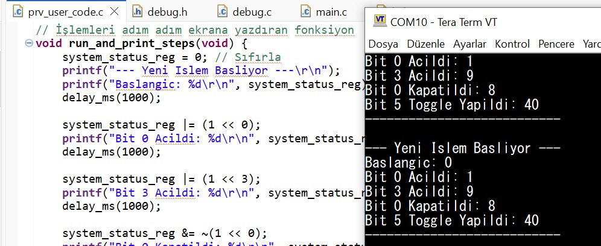
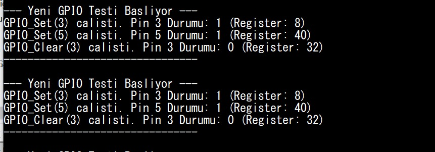
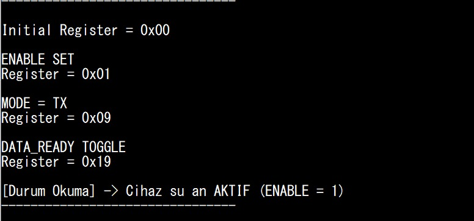

29.07.2026 – Bit İşlemleri, Register Kontrolü ve Pointer Uygulaması

Bu çalışmada mikrodenetleyicilerde donanım kontrolünün temelini oluşturan register yapıları ve bit seviyesinde programlama yöntemleri incelendi. 
Binary ve hexadecimal sayı sistemleri tekrar edilerek bit işlemlerinin gömülü yazılımdaki önemi değerlendirildi. Amaç, registerlar üzerinde güvenli ve 
kontrollü değişiklik yapabilen fonksiyonların geliştirilmesini öğrenmekti.

Öncelikle decimal, binary ve hexadecimal sayı sistemleri arasındaki dönüşümler incelendi ve 8, 16 ve 32 bitlik register yapılarının çalışma mantığı 
öğrenildi. Daha sonra C programlama dilinde kullanılan AND, OR, XOR, NOT ve Shift operatörleri kullanılarak bit açma, temizleme, tersleme ve okuma 
işlemleri gerçekleştirildi. Bit maskeleme tekniğinin aynı port üzerindeki diğer bitlerin durumunu koruması açısından önemli olduğu uygulamalı olarak 
gözlemlendi. Ardından simüle edilen 8 bitlik bir register üzerinde farklı senaryolar oluşturularak bit işlemleri test edildi. Bonus çalışma kapsamında 
pointer kullanılarak bellek adresi üzerinden çalışan modüler bit işlemi fonksiyonları geliştirildi ve fonksiyonların doğru çalışması UART terminalinde 
hexadecimal formatta doğrulandı.

Yapılan çalışmalar sayesinde register kontrolü, bit manipülasyonu ve pointer kullanımı konularında uygulamalı deneyim kazanıldı. Geliştirilen 
fonksiyonların modüler yapıda çalıştığı doğrulanırken, donanım kontrolünde bit seviyesinde programlamanın önemi daha iyi kavranmış oldu.


# Teorik Sorular (Cevapları rapora yaz)

**1.** Bit nedir? Byte ile arasındaki fark nedir?

Bit: Bilgisayar sistemlerindeki ve dijital elektronikteki en küçük veri birimidir. Sadece elektriksel olarak "var/yok" veya "yüksek/düşük" durumlarını temsil eden 1 veya 0 değerini alabilir.
Byte: 8 adet bitin yan yana gelmesiyle oluşan veri bloğudur. (1 Byte = 8 Bit). Bitler donanımsal seviyedeki tekil şalterleri ifade ederken, byte'lar genellikle hafıza organizasyonunda (karakterler, sayılar vb.) kullanılan standart temel birimdir.


**2.** Binary sayı sistemi neden mikrodenetleyicilerde önemlidir?

Mikrodenetleyiciler, fiziksel olarak milyonlarca transistörden oluşur. Bu transistörlerin sadece iki durumu vardır: Akım geçiriyor (Açık - 1 / HIGH) veya akım geçirmiyor (Kapalı - 0 / LOW). Binary (ikilik) sistem, bu fiziksel donanım yapısının doğrudan matematiksel karşılığıdır. İşlemci başka hiçbir sayı sistemini (decimal veya hexadecimal) fiziksel olarak anlayamaz; donanım seviyesinde haberleşmenin ve pinleri kontrol etmenin tek yolu binary mantığıdır.

**3.** Aşağıdaki işlemin sonucu nedir?

```c
uint8_t value = 0x00;

value |= (1 << 3);
```

Sonucu hexadecimal ve binary olarak göster.

Sonuç (Binary):** `0000 1000`
Sonuç (Hexadecimal): `0x08`


**4.** Aşağıdaki kod ne yapar?

```c
value &= ~(1 << 5);

```
Bu işlem CLEAR (Bit Temizleme/Kapatma) işlemidir. Değişkenin sadece 5. bitini sıfır (0) yapar. VE (`&`) ile DEĞİL (`~`) operatörleri birlikte kullanıldığı için diğer tüm bitlerin mevcut durumu (1 ise 1, 0 ise 0 kalacak şekilde) korunur.

**5.** Aşağıdaki işlemin sonucu nedir?

```c
uint8_t value = 0x08;

value ^= (1 << 3);
```

Açıklayınız.

Sonuç:** `0x00` (Binary: `0000 0000`)
Açıklama: `0x08` değerinin binary karşılığı `0000 1000`'dır (Yani 3. bit zaten 1'dir). `^=` XOR (Özel VEYA / TOGGLE) operatörüdür. XOR operatörü, hedef biti tersler. 3. bit başlangıçta 1 olduğu için, bu işlem sonucunda 0'a dönüşür ve tüm değer sıfırlanır.


**6.** Maskeleme (bit masking) nedir? Neden kullanılır?

Maskeleme, bir veri bloğundaki belirli bitleri veya bit gruplarını izole etmek, okumak veya değiştirmek için VE (`&`), VEYA (`|`), XOR (`^`) gibi mantıksal operatörlerin bir şablon (maske) ile kullanılmasıdır.
Kullanım Amacı: Bir register üzerinde işlem yaparken, ilgilenmediğimiz diğer bitlerin durumunu bozmadan sadece hedeflediğimiz bitleri güvenli bir şekilde değiştirebilmek için kullanılır.


**7.** Bir register içerisindeki sadece 4. biti değiştirmek istiyorsunuz. Diğer bitlerin değişmemesi için hangi yöntem kullanılır?

Diğer bitleri korumak için mantıksal operatörlerle maskeleme yöntemleri kullanılır:
4. Biti 1 (SET) yapmak için:** `reg |= (1 << 4);` (OR maskesi)
4. Biti 0 (CLEAR) yapmak için:** `reg &= ~(1 << 4);` (AND NOT maskesi)
4. Biti terslemek (TOGGLE) için:** `reg ^= (1 << 4);` (XOR maskesi)


**8.** Aşağıdaki değerin decimal karşılığını bulun:

```
0b10101010
```

Hesaplama: (1 × 128) + (0 × 64) + (1 × 32) + (0 × 16) + (1 × 8) + (0 × 4) + (1 × 2) + (0 × 1)
Sonuç: 128 + 32 + 8 + 2 = 170


**9.** STM32 gibi mikrodenetleyicilerde GPIO kontrolünde neden bit işlemleri kullanılır?

Mikrodenetleyicilerde donanım pinleri, 16 veya 32 bitlik Output/Input Register'larına (ODR, IDR) fiziksel olarak bağlıdır. Sadece tek bir LED'i yakmak veya bir butonu okumak için koca bir portun (16 pinin birden) değerini aynı anda değiştirmek sistemi bozar. Bit işlemleri sayesinde sadece ilgili pine ait bit değiştirilir, porttaki diğer pinler etkilenmez. Ayrıca bu yöntem donanıma en hızlı, doğrudan ve minimum hafıza tüketerek erişme yoludur.


**10.** Aşağıdaki kodun amacı nedir?

```c
#define LED_PIN 5

GPIOA->ODR |= (1 << LED_PIN);
```
Amacı: STM32 gibi ARM mimarili bir işlemcide, GPIOA portunun 5. pinine (LED_PIN) fiziksel olarak "HIGH" (Lojik 1 / 3.3V) sinyali göndermektir. 
Açıklama:Kod, GPIOA portunun ODR (Output Data Register - Çıkış Veri Kaydedicisi) register'ındaki 5. biti OR (`|`) operatörü ile SET etmektedir. Bu sayede GPIOA portundaki diğer pinlerin çıkış durumları bozulmadan sadece 5. pine bağlı donanım çalıştırılır.


Değer Değişimi değişimi:




Örnek 2:




Görev:

