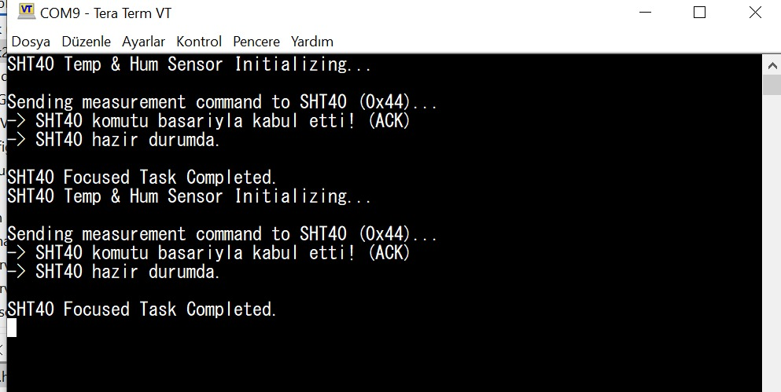

Tarih: 03.08.2026, Pazartesi
Konu: I2C Haberleşme Protokolü Teorisi, Bus Tarama ve Sensör Register Okuması

1. I2C Protokolü Teorisi ve Donanım Temelleri
UART ve SPI'dan farklı olarak sadece iki hat (SDA ve SCL) üzerinden çoklu cihaz iletişimine olanak tanıyan I2C protokolünün çalışma mimarisi incelenmiştir:
* İletişim Kuralları: Master-Slave mimarisi, 7-bit adresleme mantığı, veri okuma/yazma (R/W) durumları, başlatma (START) ve bitiş (STOP)
 koşulları ile ACK/NACK onay mekanizmaları öğrenilmiştir.
* Donanım Gereksinimleri: Protokolün open-drain (açık-drenaj) yapısı nedeniyle hatlarda pull-up direnç kullanılması gerektiği ve slave cihazların 
senkronizasyon için kullandığı "clock stretching" mantığı kavranmıştır.

2. I2C Scanner (Bus Tarama) ve Firmware Hata Ayıklama
I2C hattına (I2C2) bağlı aktif cihazların tespiti için 0x08 ile 0x77 adres aralığını tarayan bir I2C Scanner algoritması geliştirilmiştir:
* Donanım Kilitlenmesinin Çözümü: Geliştirme sürecinde I2C hattının kilitlenmesi (bus lock-up) ve watchdog reset nedeniyle işlemcinin başa 
sarması sorunuyla karşılaşılmıştır.
* Fonksiyon Optimizasyonu: Bu sorun, mikrodenetleyici kütüphanesindeki iletim fonksiyonlarında parametrelerin bloklayıcı (blocking) moda alınması ve cihazlardan NACK dönmesi durumunun döngüyü kırması sağlanarak başarılı bir şekilde çözülmüştür.

3. Datasheet Analizi ve WHO_AM_I Register Doğrulaması
Donanımda bulunan sensörlerin varlığını yazılımsal olarak doğrulamak için datasheet (veri yaprağı) üzerinden register adresleri çıkarılmış ve kimlik okuma testleri yapılmıştır:
* Register Okuma Testi: LIS2DE12 ivmeölçer sensörünün WHO_AM_I (0x0F) kimlik register'ından beklenen 0x33 değerini okumak üzere I2C testleri yapılmış, 
donanımdan yanıt alınamaması (Hata: -9) üzerine sensörün ilgili adreslerde aktif olmadığı kanıtlanmıştır.
* Hata Yönlendirmesi ve Altyapı: Tüm I2C yanıtları ve hata kodları, UART donanımı kullanılarak bilgisayar terminaline anlık olarak aktarılmış; 
SHT40 sıcaklık ve nem okuma görevi için hatasız çalışan bir I2C altyapısı doğrulanmıştır.

---- GÖREV 3------- 

1. I2C nedir?
İki hat (SDA ve SCL) üzerinden çoklu cihaz desteği sunan, senkron ve seri bir haberleşme protokolüdür.

2. UART ve SPI’dan farkı nedir?
UART asenkrondur (clock yoktur). SPI 4+ hat kullanır ve cihaz seçimi (CS) gerektirir. I2C ise sadece 2 hat kullanır ve cihazları adresleme ile seçer.

3. SDA ve SCL ne işe yarar?
SDA (Serial Data) veri akışını, SCL (Serial Clock) ise haberleşmenin senkronizasyonunu sağlayan saat sinyalini taşır.

4. Master ve Slave nedir?
Master haberleşmeyi başlatan ve clock (SCL) üreten ana cihazdır. Slave ise kendi adresi çağrıldığında yanıt veren hedef cihazdır.

5. 7-bit ve 10-bit adres nedir?
I2C hattındaki cihazları ayırt eden kimliklerdir. 7-bit yaygın olandır (max 128 cihaz), 10-bit ise daha fazla cihaz (max 1024) bağlamak için kullanılır.

6. ACK / NACK nedir?
ACK, verinin hatasız alındığını bildiren onaydır (SDA Low). NACK, iletişimin bittiğini veya cihazın hazır olmadığını belirtir (SDA High).

7. START ve STOP koşulları nasıl oluşur?
SCL High konumundayken SDA'nın High'dan Low'a çekilmesi START; SCL High iken SDA'nın Low'dan High'a çekilmesi STOP koşuludur.

8. Clock Stretching nedir?
Slave cihazın gelen veriyi işlemek için zamana ihtiyaç duyduğunda SCL hattını Low'da tutarak Master'ı bekletmesi durumudur.

9. Pull-up direnç neden kullanılır?
I2C hatları open-drain (açık drenaj) olduğu için cihazlar hattı sadece Low'a çekebilir. Hat boşta iken sinyalin High (1) seviyesinde tutulabilmesi için pull-up dirençleri zorunludur.

Görev 1 Görüntüsü:

Görev 2 Görüntüsü:

