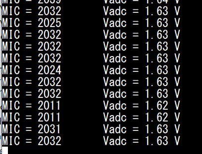

Tarih: 30.07.2026, Perşembe
Konu: Analog Mikrofon Okuma, ADC Yapılandırması ve UART Loglama

1. ADC (Analog-Dijital Dönüştürücü) ve Mikrofon Teorisi
Sistemde bulunan analog mikrofon sensöründen gelen sürekli (AC) ses sinyallerinin, mikrodenetleyicinin işleyebileceği ayrık dijital değerlere 
dönüştürülmesi mantığı incelenmiştir:

* Sinyal Karakteristiği ve DC Bias: Pil gerilimi gibi sabit DC sinyallerin aksine, mikrofon çıkışının çevresel ses basıncı değişimlerine bağlı olarak 
alternatif (AC) salınım yaptığı ve bu salınımın 0V yerine referans geriliminin orta noktasına (DC Bias - sessiz ortamda yakl. 1.65V) oturtulduğu
 öğrenilmiştir.
* Gerilim Dönüşümü ve Örnekleme: 12-bit ADC çözünürlüğü ve 3.3V referans gerilimi baz alınarak ham verilerin gerilime dönüştürülme hesaplamaları yapılmış; 
analog sinyalin karakteristiğinin kaybolmadan dijitale aktarılabilmesi için örnekleme hızının kritik rolü kavranmıştır.

2. Gömülü Yazılım ile ADC Okuma ve UART Aktarımı
Mikrodenetleyici (ABOV) üzerinde uygun ADC kanalı yapılandırılarak mikrofon pininden okuma işlemi gerçekleştirilmiş ve okunan değerlerin 
bilgisayar ortamına aktarımı sağlanmıştır:

* Kanal Konfigürasyonu: Kart şeması ve entegre veri kağıtları (datasheet) incelenerek mikrofonun bağlı olduğu fiziksel pin ve ilgili 
ADC kanalı tespit edilmiş, yanlış kanal eşleştirmelerinin donanım okumalarındaki olumsuz etkileri doğrulanmıştır.
* UART Loglama: Elde edilen ham (raw) okumalar, belirli zaman periyotlarıyla UART donanımı üzerinden bilgisayar terminaline aktarılmış; 
sessiz ortamdaki dar bantlı stabil okumalar ile gürültülü ortamdaki geniş genlikli salınımlar arasındaki farklar terminal üzerinden anlık olarak 
gözlemlenmiştir.

3. Veri Anlamlandırma, Zirve (Peak) Tespiti ve Durum Kaydı
Yalnızca ham veri okumakla kalınmayıp, elde edilen dijital verileri anlamlı sistem uyarılarına çevirmek amacıyla yazılımsal algoritmalar 
ve karar yapıları geliştirilmiştir:

* Ses Seviyesi ve Peak Tespiti: Pencereleme yöntemiyle okunan maksimum ve minimum değerler üzerinden genlik hesaplanmış; bu genlik seviyelerine 
göre ortam durumuna "QUIET", "NORMAL" veya "LOUD" etiketleri atanarak ani ses patlamalarını algılayan (Peak Detection) bir yapı oluşturulmuştur.
* Bit İşlemleri ile Status (Durum) Register'ı: Önceki konularda öğrenilen bit düzeyinde operatörler kullanılarak 8-bitlik bir durum kaydedici 
 tanımlanmış; ADC ölçümünün bitmesi, ses algılanması ve yüksek ses alarm durumları bu değişkendeki spesifik bitlere yazılarak (SET)
 terminal üzerinden Hexadecimal formatta doğrulanmıştır.

 MIC,VADC Görüntüsü:

