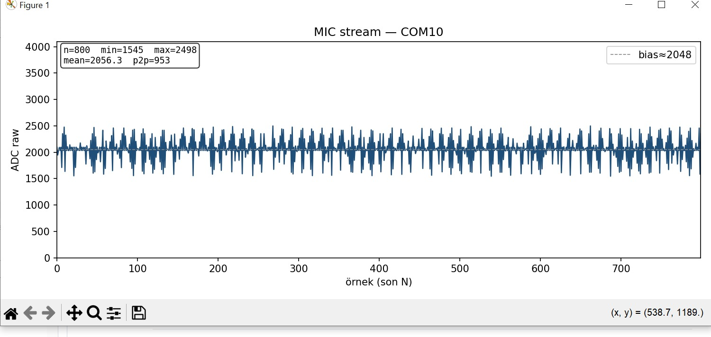
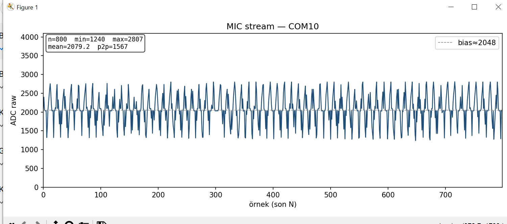
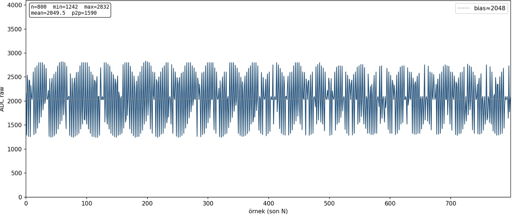

31.07.2026 – Mikrofon Stream, UART Veri Aktarımı ve Python Canlı Grafik Uygulaması

Stajın bu gününde mikrofon verilerinin tek seferlik okunması yerine sürekli veri akışı şeklinde bilgisayara aktarılması üzerine çalışmalar gerçekleştirildi. 
Sürekli örnekleme mantığı incelenerek Nyquist teoremi ve örnekleme frekansının sinyal kalitesi üzerindeki etkisi değerlendirildi. 
Amaç, elde edilen ADC verilerini Python ortamında gerçek zamanlı grafik olarak görüntülemekti.

İlk olarak Nyquist örnekleme teoremi incelenerek belirli frekanstaki sinyaller için gerekli minimum örnekleme hızları değerlendirildi. 
Daha sonra mikrodenetleyici yazılımı optimize edilerek UART üzerinden yüksek hızda kesintisiz veri gönderimi sağlandı. Python tarafında 
pyserial kütüphanesi ile seri porttan gelen veriler okunurken matplotlib kullanılarak gerçek zamanlı grafik oluşturuldu. Donanım bağlantısından önce 
simülasyon modu kullanılarak sistem test edildi ve yazılımın doğru çalıştığı doğrulandı. Sonrasında gerçek mikrofon verileri okunarak sessiz ortam ve 
1000 Hz sinüs sinyali altında oluşan değişimler canlı grafik üzerinde gözlemlendi ve sistem performansı değerlendirildi.

Çalışma sonunda mikrodenetleyici, UART haberleşmesi ve Python uygulaması arasında kesintisiz veri akışı başarıyla sağlandı. Gerçek zamanlı grafik sayesinde
analog ses sinyalleri anlık olarak izlenebildi ve gömülü sistem ile bilgisayar arasındaki veri işleme süreci uygulamalı olarak öğrenilmiş oldu.

1 kHz Sinyal Görüntüsü:

2 kHz Sinyal Görüntüsü:

8 kHz Sinyal Görüntüsü:

